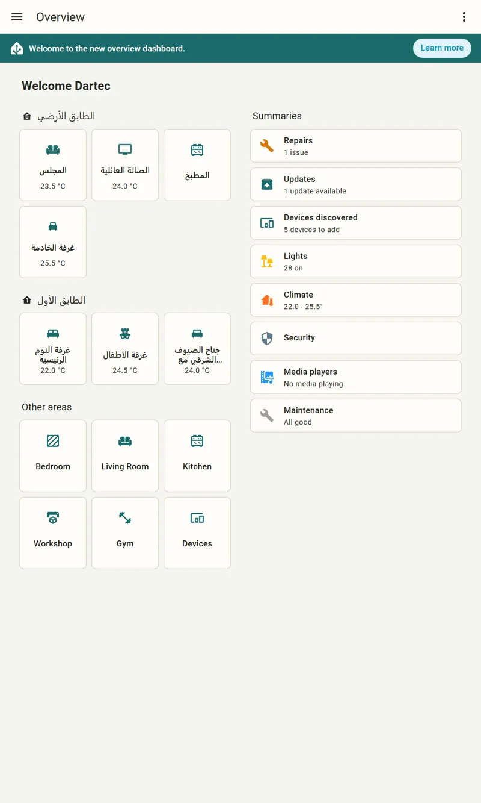
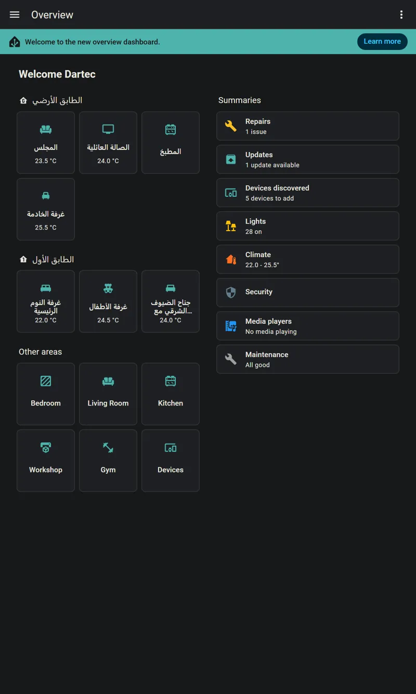
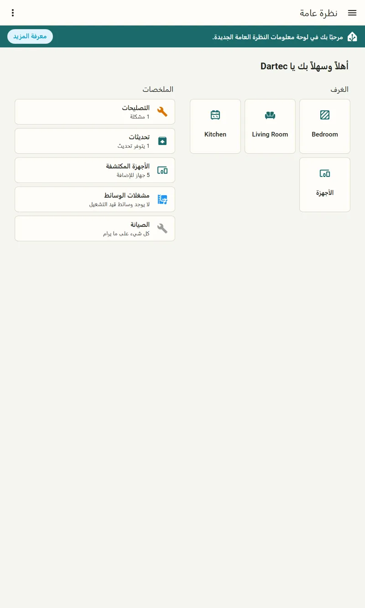
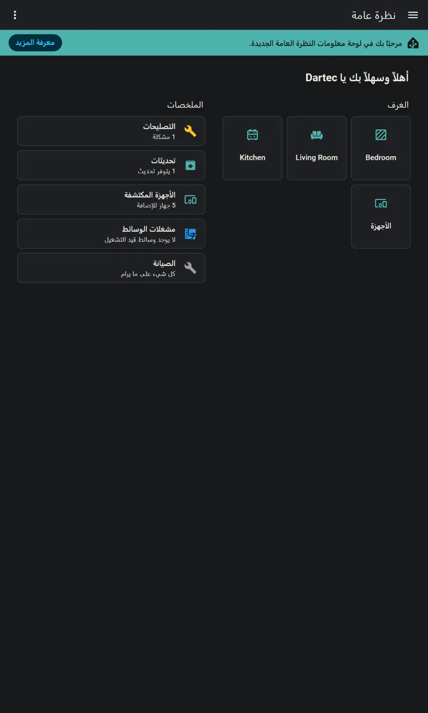
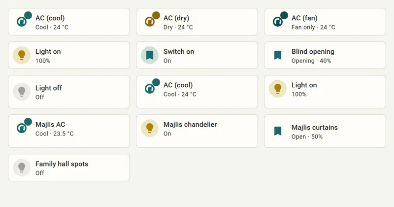
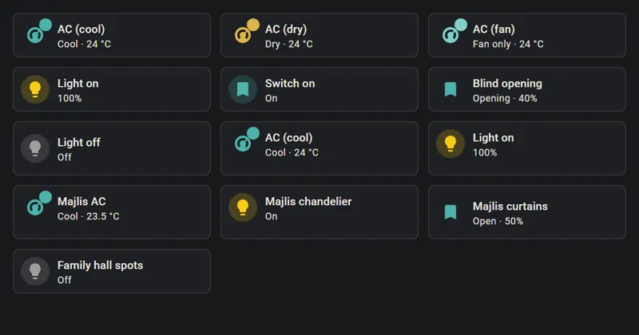
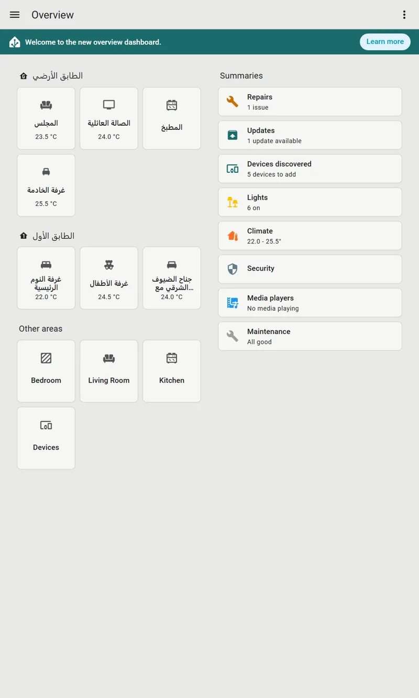
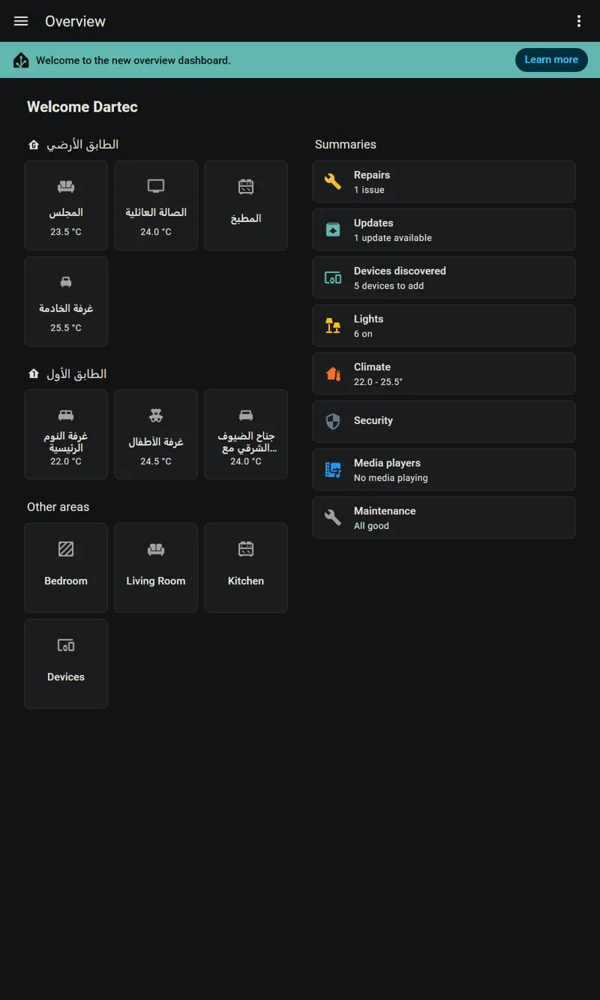
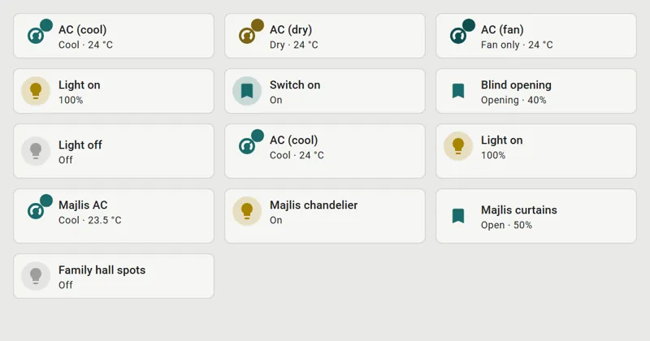
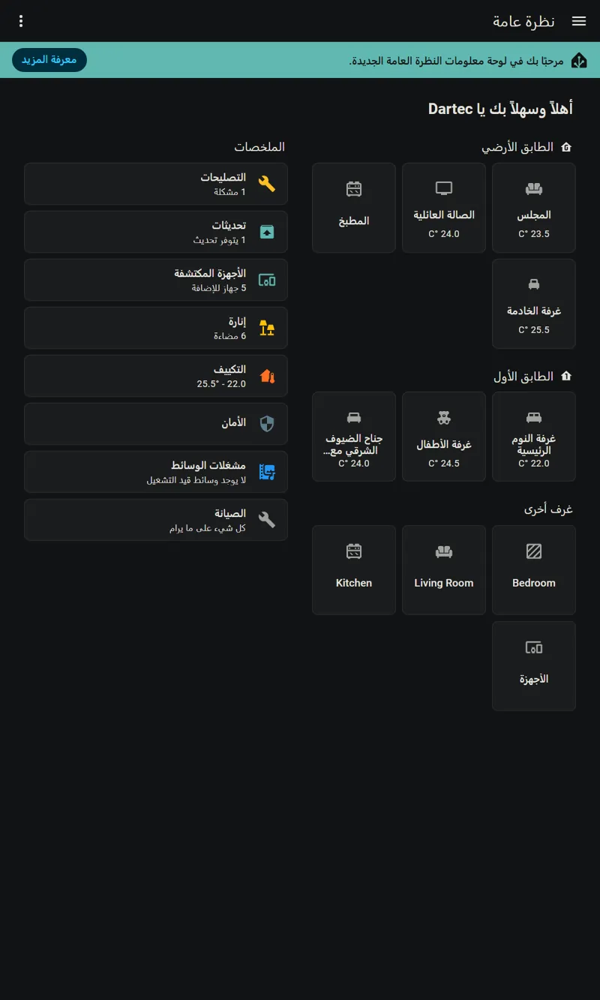

# Baytec Theme

The official Baytec Smart Homes themes for Home Assistant, each with light and dark modes in one theme.

Baytec («بيتك») was Dartec until October 2026. Every theme is also published under its old Dartec name ("Dartec", "Dartec Graphite" and so on), identical to its Baytec twin, so a home that stores an old name as its default keeps its look. Pick the Baytec names for anything new.

| Theme | What it is |
|---|---|
| **Baytec** | The house theme: brand teal on warm cream and paper. Teal for everything interactive, a readable gold for lights that are on. |
| **Baytec Graphite** | Quiet warm-graphite surfaces with grey icons, and teal only where something is on. The theme for wall panels, and in dark mode for bedrooms at night. |
| **Baytec Glass** | Frosted, translucent cards over a deep teal gradient. The most distinctive look, and the costliest to draw: for phones and capable tablets, not wall panels. |
| **Baytec Glass Lite** | Glass's colours and gradient with solid cards and no blur, so it draws about as cheaply as an opaque theme. The Glass look for wall panels and slower tablets. |
| **Baytec Soft** | Borderless paper cards that float on a soft shadow in light mode, with a hairline edge in dark mode. |
| **Baytec Material** | Tonal surfaces generated from the brand teal with Material 3's colour method, in rounder 16 px cards with no border or shadow. |

- **Light and dark** are both written in full; Home Assistant follows the device's setting.
- **Theme variables only.** No card-mod, no JavaScript, no images, nothing downloaded.
- **WCAG AA in both modes.** Text is at least 4.5:1 and icons and controls at least 3:1, checked on every change by [`scripts/contrast.py`](scripts/contrast.py). Where a view's ground is a gradient, or a card is glass, the worst place a card can sit is what is measured. [`scripts/check_themes.py`](scripts/check_themes.py) checks each theme's structure and every colour value.
- **No copper.** The brand reserves copper for content written by AI.

## Screenshots

Home Assistant 2026.9 on the test bench, with the themes installed through HACS. Taken under the Dartec names, which are the same themes.

**Baytec**, light and dark, in English and Arabic:

| Light | Dark |
|---|---|
|  |  |
|  |  |
|  |  |

**Baytec Graphite**:

| Light | Dark |
|---|---|
|  |  |
|  |  |

Screenshots of Glass, Glass Lite, Soft and Material are still to come.

## Which theme where

- **A home's default:** Baytec.
- **Wall panels:** Baytec Graphite, or Baytec Glass Lite for the Glass look. Bedroom panels at night: Graphite in dark mode.
- **Baytec Glass** blurs what is behind every card. Drawn without a graphics chip, as a stand-in for a weak tablet, the blur multiplied the drawing work about elevenfold and dropped a third of the frames while scrolling. Keep it to phones and capable tablets until it has been measured on the real panels, and give the panels Glass Lite.
- **Soft and Material** are alternatives a family can pick for themselves.

A theme picked in a person's own profile overrides the home's default, so a panel's own account can use one theme while the family's phones use another.

## Install

Homes managed by the Baytec HA Manager receive these themes automatically. To install them by hand:

1. HACS → ⋮ → Custom repositories → add this repository (category: **Theme**), then download it.
2. Make sure `configuration.yaml` contains:
   ```yaml
   frontend:
     themes: !include_dir_merge_named themes
   ```
3. Restart Home Assistant, then pick a Baytec theme in your profile, or let your Baytec installer set it for the home.

Since Home Assistant 2026.2, a theme chosen in a person's own profile overrides the home's default theme.

Requires Home Assistant 2025.5 or later, the first release that reads the `ha-font-family-*` variables.

## Fonts

Every theme names the brand's Arabic face, Lateef, and IBM Plex Mono for code. A theme can name a font but cannot load one, so these appear only on pages that load them; until then Arabic uses the device's own font. Latin text is Roboto, which Home Assistant ships itself. Dubai, the brand's Latin face, is not used: its licence does not allow it to be redistributed.

## Licence

The theme files are under the [MIT licence](LICENSE).

The licence covers the files, not the brand. The names "Baytec" and "Dartec", including in these theme names, are the company's and are not licensed. If you publish a modified copy, give it and its themes a name of your own.
